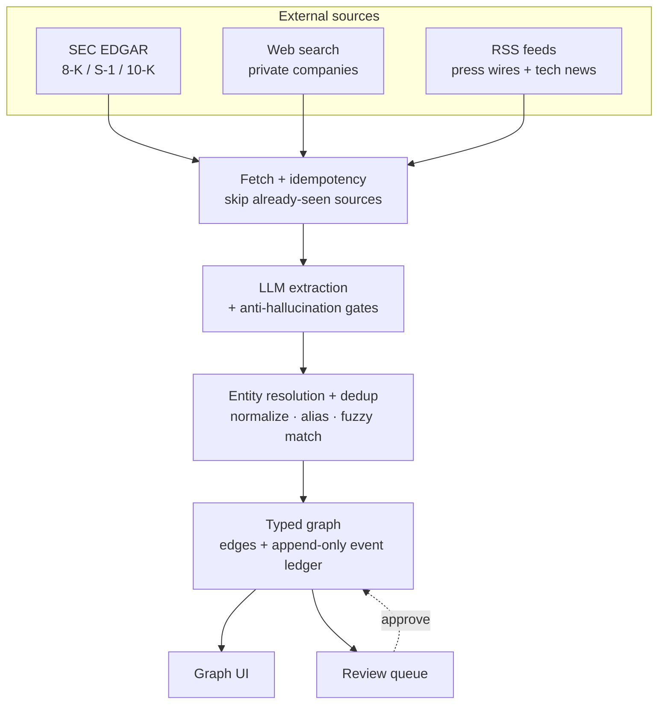

# MoneyGraph

[](https://github.com/afletunova/moneygraph-demo/actions/workflows/ci.yml)

MoneyGraph tracks capital rotation across companies, VCs, and sovereign funds — who invested how much in whom, and when. It ingests SEC filings, RSS feeds, and web search results, uses an LLM to extract structured investment events, resolves and deduplicates the entities involved, and surfaces the result as an interactive graph with a confidence-scored evidence trail behind every edge.

## How it works



The graph itself is never the source of truth — every edge's displayed amount is a computed `SUM` over its event ledger, and every event carries a source URL and a confidence tier. Nothing gets silently overwritten; corrections are appended, not edited in place. Unresolved entities wait in a review queue rather than entering the graph automatically.

Deeper technical write-up: [`docs/ARCHITECTURE.md`](docs/ARCHITECTURE.md). Live API reference: run the server and open `/docs` (FastAPI's built-in Swagger UI).

## Quickstart

```bash
git clone https://github.com/afletunova/moneygraph-demo.git
cd moneygraph-demo
cp .env.example .env
docker compose up --build
```

Open `http://localhost:3000`. The demo ships pre-seeded with a curated ~100-node snapshot of real, publicly-sourced investment data — no API keys needed to look around.

To run the backend as a library instead:

```bash
pip install -e ".[dev]"
pytest
ruff check .
```

Stack: Python 3.12 + FastAPI + Postgres 15 on the backend, React 18 + D3 v7 (Vite) on the frontend. The extraction models (`gpt-4o-mini`, escalating to `gpt-4o`) are hardcoded defaults for this demo — cheap and sufficient for this extraction shape (a short excerpt in, a small structured JSON event out); both are env-overridable if you want to try something else.

## How this was built

This repo is a deliberately simplified example. A private version exists, actively maintained, with several more months of tuning against real accumulated data — a materially more sophisticated entity-resolution pipeline, dedup logic, syndicate-round detection, and the actual production extraction prompt (this repo ships a rewritten, simplified prompt that demonstrates the same architecture — the JSON schema, the gate pattern — without the tuned business rules). That tuned prompt and its accumulated edge-case handling are the commercially valuable part, which is why the private version's history stays private rather than being squashed or ported over.

Built with an AI agent writing the code and acting as PM — coordinating tasks and, where useful, sub-agents — while I made the actual decisions: architecture calls, what to prioritise, what to cut, and what needed rethinking along the way.

The project's scope has always been research and prototyping — validating whether LLM extraction + graph resolution could reliably reconstruct capital-rotation relationships at all — not shipping production-hardened software. That shows up most in the QA methodology: quality control so far has been incident-driven, not formally tested. Gates and schema invariants were each added in response to a specific failure observed in live data (see comments in `pipeline.py` and `resolve.py`), rather than derived upfront from a labelled eval set. A first labelled ground-truth set now exists ([`evals/`](evals/) — 16 hand-labelled real cases, precision/recall over the extraction step) as the deliberate next stage before further prompt tuning; it's intentionally minimal, not a claim of full test coverage.

## Docs

- [`docs/ARCHITECTURE.md`](docs/ARCHITECTURE.md) — the deeper technical story: package layout, pipeline stages, schema design
- [`evals/`](evals/) — extraction precision/recall eval, with results
- API reference — run the server, visit `/docs`
- [`CONTRIBUTING.md`](CONTRIBUTING.md)
- [`LICENSE`](LICENSE) — MIT
