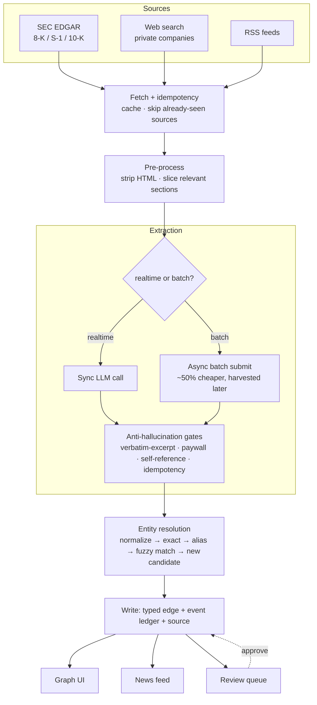

# Architecture

## Package layout

```
src/moneygraph/
├── core/       # pure logic, zero FastAPI dependency — the actual importable library
├── ingest/     # EDGAR fetch, extraction pipeline, RSS, web search
├── api/        # FastAPI app: routers split by domain, app factory
├── pipeline.py # orchestrates ingest + core for one end-to-end run
└── db.py       # thin psycopg2 query/execute helpers
```

`core/` is deliberately kept free of any web-framework dependency: entity resolution, enrichment, ticker/price lookups, and the re-resolve/syndicate-detection sweeps all work as a standalone library — `from moneygraph.core import resolve, enrich, lookup_ticker` — independent of whether anything is running a server. `api/` depends on `core/` and `ingest/`, never the other way around.

`api/` itself is split by domain rather than one flat file: `routers/nodes.py`, `routers/graph.py`, `routers/pipeline.py`, `routers/candidates.py`, `routers/settings.py`, each owning its own routes and request models, wired together by an app factory (`api/main.py`).

The frontend mirrors the same instinct: `components/` holds shared UI pieces (node detail panel, price chart, filters), `views/` holds one file per tab (Graph, Nodes, News, Review Queue, Runs, Settings).

## Pipeline stages



Both extraction backends (realtime and batch) share the same downstream gate/resolve/write path — the only difference is whether the LLM call blocks the request or gets submitted and harvested later. The gates exist because web/RSS-sourced text is the highest-hallucination part of the pipeline: an excerpt gate rejects anything the model didn't quote verbatim from the source, a self-reference gate catches a company being extracted as its own investor, an idempotency gate skips content already processed.

Entity resolution runs in escalating passes — exact name match, then registered alias, then fuzzy match within a tight edit-distance threshold, and only creates a new "candidate" (queued for human review) when nothing matches. This is why the review queue exists: an unresolved name never silently becomes a new graph node on its own.

## Schema design

- **Edges are typed** (`ownership` / `subsidiary` / `joint_venture`, extensible) rather than one generic relationship.
- **Events are an append-only ledger, not the source of truth by mutation** — an edge's displayed amount is always `SUM(delta_usd)` over its events, computed on read. A correction is a new signed event, never an edit to an old one.
- **Confirmed vs. estimated amounts are tracked separately.** When a single funding round names several co-investors with no per-investor breakdown, the full round amount is real but not attributable to any one investor with certainty — rather than guess a split (which produces *a* number, not a *true* one), those events are flagged `estimated` and kept separate from `confirmed` in every total the UI shows. This is the single most important invariant in the schema: it's the difference between an honest graph and a precise-looking wrong one.
- **`node_facts` / `node_tickers`** hold enrichment (sector, country, description, exchange listings) fetched from Wikidata/EDGAR/Yahoo Finance, kept separate from the core `nodes` table so enrichment failures never block graph writes.

## Testing

17 test files under `tests/`, run with `pytest`. Everything is mocked at the DB/network boundary — no live Postgres or external API calls in the suite itself, so it runs the same in CI as it does locally. `ruff` handles linting and formatting.
